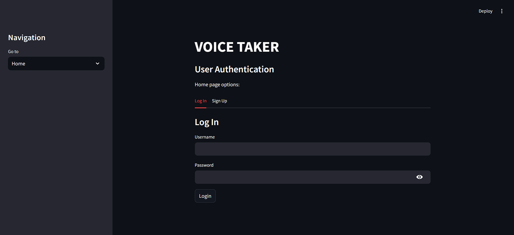
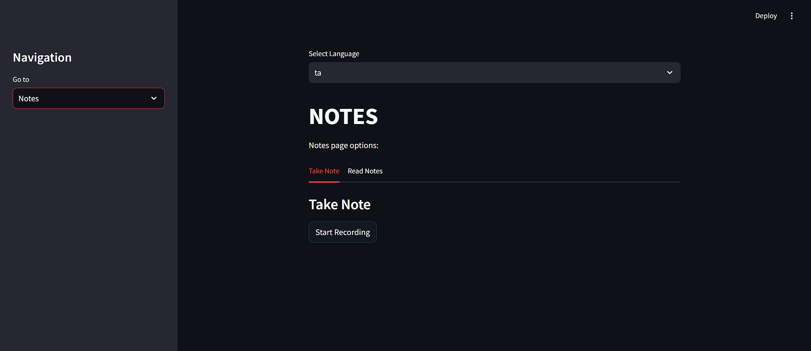
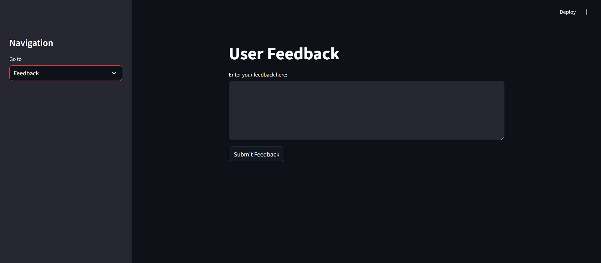

# Voice Taker

## Description
Voice Taker is a web application that allows users to take notes using voice input. The application captures audio and video, translates the audio to text, and stores the notes along with their translated versions. The notes are saved in a DynamoDB database, and audio files are uploaded to an S3 bucket for easy access.

## Features
- User authentication (sign up and log in)
- Voice recognition for taking notes
- Audio and video recording
- Translation of notes into English
- Store notes with audio and video links
- Feedback submission

## Installation

1. Clone the repository:
   ```bash
   git clone https://github.com/yourusername/voice-taker.git

   cd voice-taker

2. Install the required packages:

    ```bash
    pip install -r requirements.txt

3. Set up your AWS credentials and create the necessary DynamoDB tables and S3 bucket.

## Usage

1. Run the Chalice application:

    ```bash
    chalice deploy
    ```

2. Open the Streamlit app:

    ```bash
    streamlit run app.py
    ```
3. Access the application in your web browser at http://localhost:8501.







## API Endpoints

1. Get Notes
    Endpoint: /get_notes/{username}
    Method: GET

2. Delete Note
    Endpoint: /delete_note/{username}/{note_id}
    Method: DELETE

## Technologies Used

Python

AWS (DynamoDB, S3)

Streamlit

Google Text-to-Speech and Translator

OpenCV for video recording

SpeechRecognition for audio transcription

## Contributing

Contributions are welcome! Please submit a pull request or open an issue to discuss changes.
